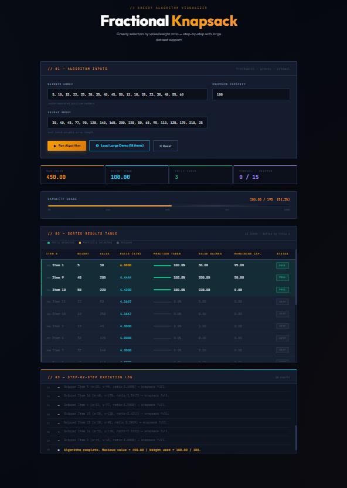

<h1 align="center">Fractional Knapsack Visualizer</h1>

TEAM MEMEBERS

1)K.C.Bharath -- AP24110011356

2)E.Akhil -- AP24110011277

3)M.Teja -- AP24110011520

4)P.purna chandra rao -- AP24110011303

A web-based interactive visualization tool for the Fractional Knapsack Algorithm, demonstrating greedy selection based on value-to-weight ratio with step-by-step execution.

🚀 Features
Greedy algorithm implementation (value/weight ratio based)
Step-by-step execution log
Sorted results table with:
Item weight
Item value
Ratio (v/w)
Selected fraction
Real-time capacity tracking
Interactive UI with dynamic inputs
Large dataset support

📸 Preview

🧠 Algorithm Used

This project uses the Fractional Knapsack Greedy Algorithm, where:

Items are sorted in descending order of value/weight ratio
Items are picked fully or partially until capacity is reached
Maximizes total value within given capacity
📂 Project Structure
├── src/
│   ├── components/
│   ├── logic/
│   ├── styles/
│   └── App.js
├── public/
├── package.json
└repo/
├── README.md
└── images/
    └── knapsack-preview.png
⚙️ Installation & Setup
# Clone the repository
git clone https://github.com/chandu999c/knapsack.git

# Navigate to project folder
cd knapsack

# Install dependencies
npm install

# Run the project
npm run dev

🛠️ Tech Stack
Frontend: HTML, CSS, JavaScript
Framework: Vite 
Styling: Custom CSS
📊 Example Input
Weights: 5, 10, 15, 22, ...
Values: 30, 40, 45, 77, ...
Capacity: 100
✅ Output
Maximum value achieved
Selected items (full/partial)
Remaining capacity visualization
🎯 Use Cases
Learning greedy algorithms
Algorithm visualization for students
Teaching data structures concepts
⚠️ Limitations
Only supports fractional knapsack (not 0/1)
UI performance may degrade with extremely large inputs
📌 Future Improvements
Add 0/1 Knapsack support (DP approach)
Graph visualization of selection process
Export results as CSV/PDF
Better mobile responsiveness
👤 Author

Your kalyanam chandra bharath
GitHub: https://github.com/chandu999c
